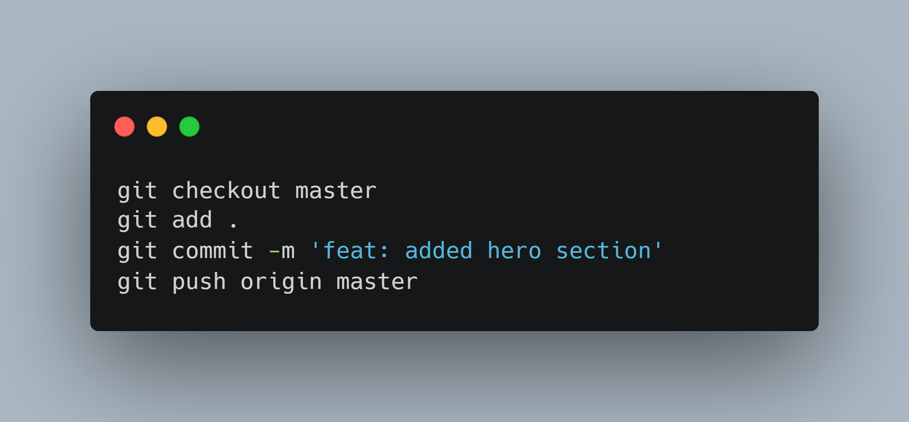
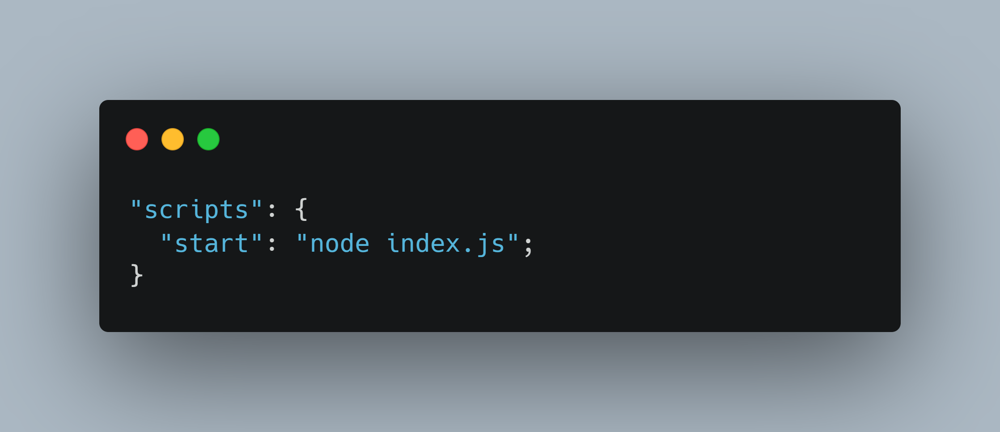

<!-- 
 -->

<h1>JOBI: JOB PORTAL PROJECT</h1>

<h2>Developers:</h2>

   

--- 

<h2>About the Project</h2>

Jobi is a cutting-edge job portal website that aims to redefine the way you search for your dream career. In a rapidly evolving job market, finding the perfect job opportunity can be daunting and time-consuming. Jobi is here to simplify this process, providing a seamless and intuitive platform that connects talented job seekers with a diverse range of employers.

---

<h2>Planning</h2>

* Screenshot of inspiration design

    

* Separation of pages per member

    

---

<h2>Planning</h2>

* Familiarization of  commands

    

* Familiarization of  boilerplate

    

---
<h2>Planning</h2>

* Identification of common components such navbar, footer, color scheme   

* Tools and languages
    - Planning     
    - Design    
    - Development     
    - Libraries        
    - Deployment  
    - Presentation  
---

<h2>Development</h2>

* Initialize  repository

* Creating  boilerplate

* Setup   daily meetings for deliverables

* Mentoring & discussing challenges via  chat

  
---
## Deployment

<!-- ###### Using   for deployment -->

* Step 1: Setting Port Number

    

* Step 2: Change package.json

    

* Step 3: Create Your Procfile

    

* Project Link: https://jobi-267797d59065.herokuapp.com/

---

# Thank you for listening.