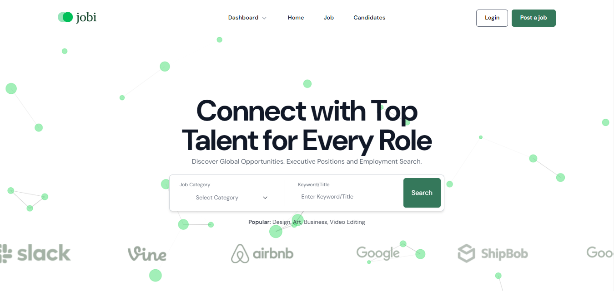
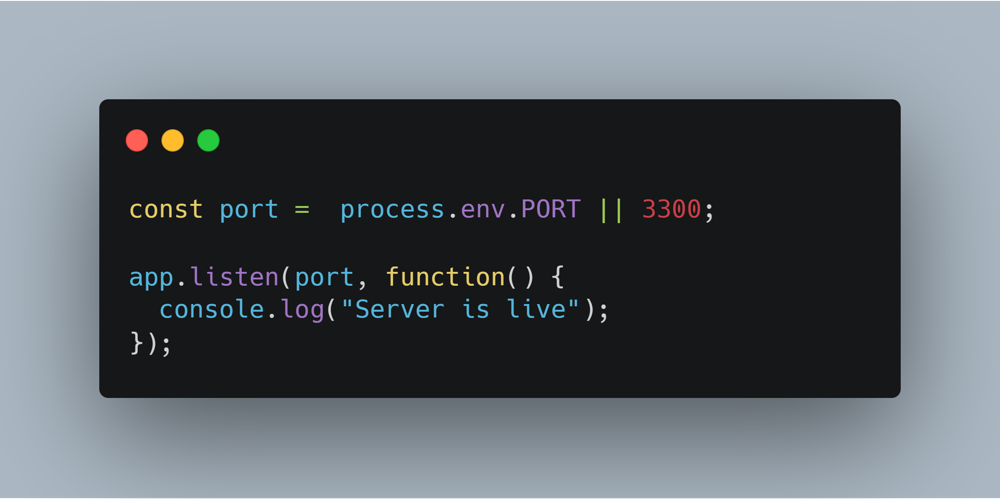
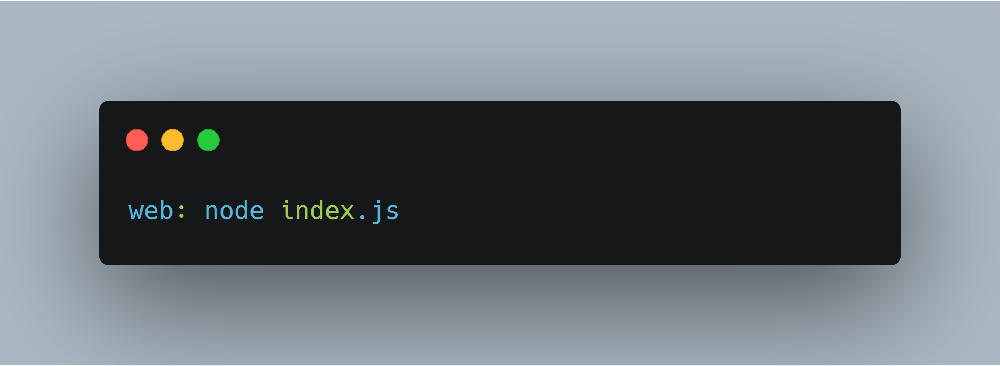

<!-- JOBI: JOB PORTAL PROJECT -->
<h1 id="readme-top">JOBI : JOB PORTAL PROJECT</h1>
<p class="header">Are you ready to embark on a journey toward your dream career? Look no further than Jobi, your ultimate job portal and the gateway to a world of professional opportunities. Whether you're a seasoned executive looking to take the next step in your career or a fresh graduate eager to make your mark, Jobi is here to guide you every step of the way.</p>

 

</br>

## Table of Contents
<details>
  <summary>VIEW TABLE OF CONTENTS</summary>
  <ol type="I">
    <li><a href="#about">About the Project</a></li>
    <li><a href="#languages">Languages & Tools Used</a></li>
    <li><a href="#developers">Developers</a></li>
    <li><a href="#project-link">Project Link</a></li>
    <li><a href="#project-style">Project Style</a></li>
    <li><a href="#usage">Usage</a></li>
    <li><a href="#pages">Pages</a></li>
    <li><a href="#steps">Steps on Deploying Using Heroku</a></li>
  </ol>
</details>
<!-- Back to Top -->
<p align="right">(<a href="#readme-top">back to top</a>)</p>

<h2 id="about">I. About the Project</h2>
Welcome to Jobi, a cutting-edge job portal website that aims to redefine the way you search for your dream career. In a rapidly evolving job market, finding the perfect job opportunity can be daunting and time-consuming. Jobi is here to simplify this process, providing a seamless and intuitive platform that connects talented job seekers with a diverse range of employers.

At Jobi, our mission is to empower individuals in their pursuit of meaningful and fulfilling careers. We are dedicated to creating a seamless and innovative job search experience that connects talented professionals with the right opportunities. Through cutting-edge technology, personalized guidance, and a commitment to user-centric design, we strive to simplify the job-seeking journey, enabling candidates to realize their full potential and contribute positively to the global workforce.

Our vision at Jobi is to revolutionize the way people approach their careers by providing a transformative platform that transcends traditional job search boundaries. We envision a future where job seekers are seamlessly matched with opportunities that align with their skills, values, and aspirations. By fostering a dynamic and inclusive job ecosystem, we aim to bridge the gap between individuals and their dream careers while fostering growth, innovation, and mutual success for both candidates and employers. Through our efforts, we aspire to be the catalyst for positive change in the world of work, enabling individuals to thrive and companies to flourish.

<!-- Back to Top -->
<p align="right">(<a href="#readme-top">back to top</a>)</p>

<h2 id="languages">II. Languages and Tools Used</h2>

#### Planning
    
</br>

#### Design
   

#### Development
    

#### Libraries
        

#### Deployment
<!-- Heroku -->
 

#### Presentation
 
<!-- Back to Top -->
<p align="right">(<a href="#readme-top">back to top</a>)</p>

<h2 id="developers">III. Developers</h2>
<a href="https://github.com/SDarius14"></a>
<a href="https://github.com/emailjohnthomascaballero"></a>
<a href="https://github.com/jebsonubaldo"></a>
<a href=""></a>
<!-- Back to Top -->
<p align="right">(<a href="#readme-top">back to top</a>)</p>

<h2 id="project-link">IV. Project Link</h2>

https://jobi-6e0b4dda90ab.herokuapp.com
<!-- Back to Top -->
<p align="right">(<a href="#readme-top">back to top</a>)</p>

<h2 id="project-style">V. Project Style</h2>
Color Scheme

<a href=""></a> <a href=""></a> <a href=""></a>

Logo

</br>

Favicon

</br>

Typography

**DM Sans**

<!-- Back to Top -->
<p align="right">(<a href="#readme-top">back to top</a>)</p>

<h2 id="usage">VI. Usage</h2>

_Below is an example of how you can install and setup the application on your device._

1. Clone the repo
   ```sh
   git clone https://github.com/SDarius14/jobportal-capstone.git
   ```
2. Install NPM packages
   ```sh
   npm install
   ```
3. Run dev and devcss
   ```sh
   npm run dev
   ```
   ```sh
   npm run devcss
   ```
<p align="right">(<a href="#readme-top">back to top</a>)</p>

<h2 id="pages">VII. Pages</h2>

- <a href="https://jobi-6e0b4dda90ab.herokuapp.com/">Homepage</a>
- <a href="https://jobi-6e0b4dda90ab.herokuapp.com/login">Login</a>
- <a href="https://jobi-6e0b4dda90ab.herokuapp.com/signup">Signup</a>
- <a href="https://jobi-6e0b4dda90ab.herokuapp.com/job-list">Job List</a>
- <a href="https://jobi-6e0b4dda90ab.herokuapp.com/job-details">Job Details</a>
- <a href="https://jobi-6e0b4dda90ab.herokuapp.com/candidates">Candidates</a>
- <a href="https://jobi-6e0b4dda90ab.herokuapp.com/candidate-profile">Candidate Profile</a>
- <a href="https://jobi-6e0b4dda90ab.herokuapp.com/candidate-dashboard">Candidate Dashboard</a>
  - <a href="https://jobi-6e0b4dda90ab.herokuapp.com/my-profile">My Profile</a>
  - <a href="https://jobi-6e0b4dda90ab.herokuapp.com/messages">Messages</a>
  - <a href="https://jobi-6e0b4dda90ab.herokuapp.com/account-settings">Account Settings</a>
- <a href="https://jobi-6e0b4dda90ab.herokuapp.com/employer-dashboard">Employer Dashboard</a>
  - <a href="https://jobi-6e0b4dda90ab.herokuapp.com/employer-profile">My Profile</a>
  - <a href="https://jobi-6e0b4dda90ab.herokuapp.com/employer-messages">Messages</a>
  - <a href="https://jobi-6e0b4dda90ab.herokuapp.com/submit-job">Submit Job</a>
  - <a href="https://jobi-6e0b4dda90ab.herokuapp.com/employer-account-settings">Account Settings</a>

  <p align="right">(<a href="#readme-top">back to top</a>)</p>

<h2 id="steps">VIII. Steps on Deploying Using Heroku</h2>
  Step 1: Setting Port Number
  
   </br>

  Step 2: Change package.json

   </br>

  Step 3: Create Your Procfile

   

  <p align="right">(<a href="#readme-top">back to top</a>)</p>
